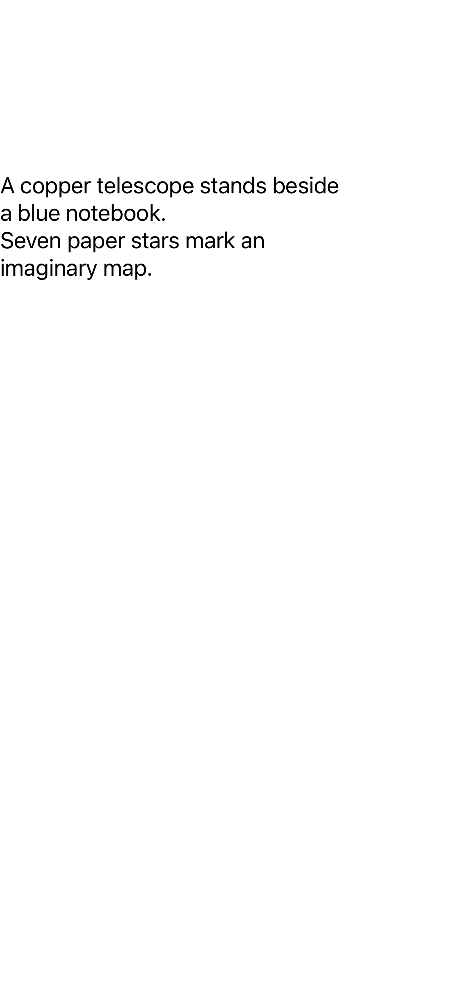

# Drawing viewport regressions

The harness uses the real Litext package, a UIKit window, a scroll view, and
freshly invented text. It does not require a server or any stored data.

Requires Xcode, an iOS simulator, and XcodeGen. Set `SIMULATOR_ID` to the UUID of
the simulator to test, then run from the repository root:

```sh
xcodegen generate --spec Tests/Viewport/project.yml
xcodebuild -project Tests/Viewport/ViewportTests.xcodeproj \
  -scheme ViewportTests \
  -destination "platform=iOS Simulator,id=$SIMULATOR_ID" \
  -derivedDataPath /tmp/litext-viewport-build \
  -resultBundlePath /tmp/litext-viewport-results.xcresult \
  -parallel-testing-enabled NO test
```

Use a new result-bundle path for each run.

## Reproduction

1. Place a label inside an offscreen parent row in a scroll view.
2. Complete its layout, so the drawing viewport is empty.
3. Move only the parent row into view, leaving the label's bounds and the
   scroll view's content offset unchanged.
4. Wait for layout/display to settle.

At `e953e5c`, the label's text remains present but its drawing view stays at
zero size. The pixel assertion finds **zero text pixels**. This also explains
why accessibility can still read a visually blank message after pagination.

Observe the backing layers' bounds, positions, and transforms through the
ancestor chain, including the label itself. Scrolls and ancestor relayouts now
refresh the same bounded drawing surface. No polling or display link is added.

## Validation

| Check | Original | Fixed |
| --- | --- | --- |
| Previously offscreen row moves onscreen | Empty drawing frame; zero text pixels | Full visible frame; text pixels present |
| 100 interleaved scrolls and parent moves | Stale viewport possible | Correct 400-point visible surface throughout |
| Clipping resize, transform, detach/re-attach | Ancestor-only changes are missed | Pass |
| Label released after removal | — | Pass |

All four tests pass on iOS 18.4 and iOS 26.5 simulators. The first test also
attaches its rendered synthetic window to the result bundle for visual review.

The same synthetic UIKit window after moving the parent row onscreen:

| Before | After |
| --- | --- |
|  |  |
