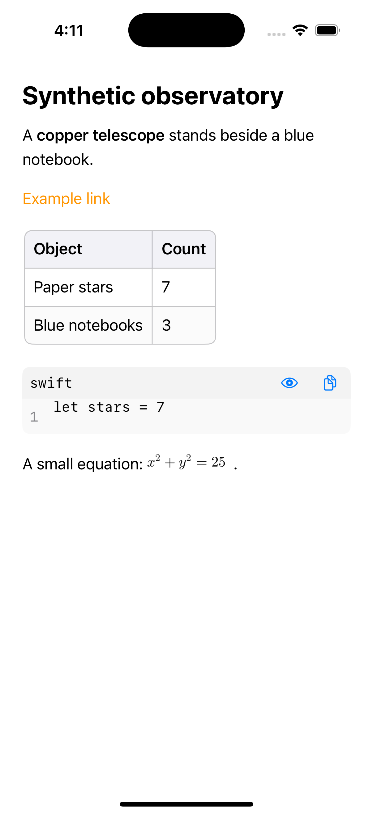

# Fork compatibility and rendering tests

All text in this harness is freshly invented synthetic content. It has no
network connection and loads no external account, chat, or database.

Generate the disposable UIKit host with XcodeGen and run on an available simulator:

```sh
xcodegen generate --spec Tests/Viewport/project.yml
xcodebuild test \
  -project Tests/Viewport/ViewportTests.xcodeproj \
  -scheme ViewportTests -configuration Release \
  -destination 'platform=iOS Simulator,id=<simulator-id>' \
  ENABLE_TESTABILITY=YES
```

- `ViewportTests`: rendered pixels after ancestor movement, bounded drawing during
  repeated scrolling/prepending, resize/transform/detach, and observer lifetime.
- `CompatibilityTests`: legacy attribute keys/delegate forwarding, Ask/Explain
  notification payloads and selection clearing, modern menu actions, and scroll
  locking/restoration used by pointer selection. Reusing a mutable attributed
  string must rebuild the layout when its contents or attributes change.
- `RendererTests`: five-iteration CPU/memory/elapsed measurements for initial
  rendering, repeated equal-text assignment, alternating widths, and scrolling;
  pixel checks at the start/middle/end of a long document and after parent movement.

The original fork at `e953e5c` fails the ancestor-move pixel reproduction; the
small fix in #1 and this upstream-sync version pass. The maximum drawing surface
remains the clipped visible viewport, not the full document height.

Validation: 16 tests passed on iOS 18.4; the initial 15-test suite also passed on
iOS 26.5. 31 upstream SwiftPM tests
passed on macOS. A Release build of the existing MarkdownView consumer at
`2654e0d8254816bb9c1bdcbb73fa43bcc0f9f429` compiled against the local updated
package without consumer source edits. Mac Catalyst also built successfully.
WatchOS was not locally tested because its SDK/runtime is not installed.

The screenshot below is generated by the ancestor-move test on the synced fork:


The existing MarkdownView consumer also renders its table, code block, and
equation correctly. Keeping an immutable snapshot for the equality fast path is
required: that consumer mutates and reassigns one attributed-string object.


